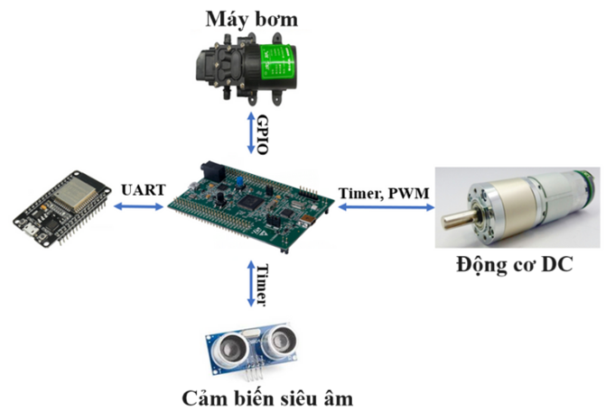
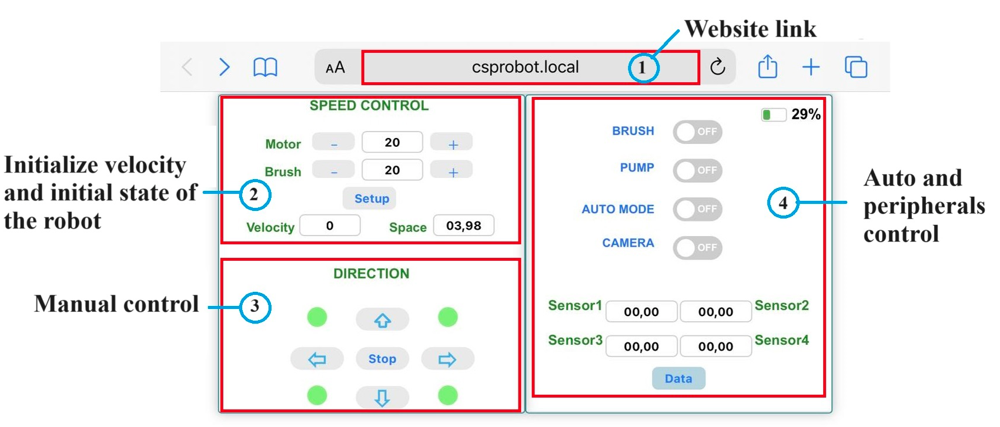

# ROBOT CLEAN SOLAR PANELS

## Tổng quan dự án

- Dự án Robot vệ sinh pin mặt trời được phát triển nhằm tự động làm sạch bề mặt tấm pin năng lượng mặt trời, giúp nâng cao hiệu suất hoạt động và tuổi thọ của pin, giảm chi phí vận hành và tăng độ bền hệ thống. 

- Robot bao gồm:

    + Vi điều khiển chính chịu trách nhiệm điều khiển động cơ, cảm biến, bàn chải và logic vận hành.

    + Vi điều khiển phụ dùng làm bộ điều khiển giao diện người dùng (UI) qua web, cho phép điều khiển từ xa và giám sát trạng thái robot.

## Kiến trúc hệ thống


## Chi tiết phần cứng

- Pin 12.6V cấp cho toàn bộ hệ thống.

- Vi điều khiển STM32F407:

    + Động cơ DC điều khiển robot di chuyển và bàn chải xoay để làm sạch bề mặt pin.

    + Cảm biến Encoder để đo tốc độ và quãng đường di chuyển robot.

    + Cảm biến siêu âm để đo khoảng cách giữa robot và bề mặt tấm pin nhằm tránh robot rơi ra khỏi tấm pin.

    + Relay điều khiển máy bơm nước làm ẩm bàn chải (tùy chọn).

    + LEDs báo trạng thái di chuyển (Tiến, lùi, trái, phải).



- Vi điều khiển ESP32:

    + Kết nối Wi-Fi

    + Host Web Server cho UI điều khiển từ xa.

    + Giao tiếp UART với STM32 để gửi/nhận lệnh và trạng thái.

## Chi tiết phần mềm

- STM32:

    + Sử dụng thư viện SPL (Standard Peripheral Library) của STM32F4.

    + Cấu hình các Timer, GPIO, ADC, DMA, UART theo chuẩn SPL.

    + IDE: KeilC

- ESP32:

    + IDE: Arduino IDE

## Cấu trúc thư mục

```cpp

Robot_Clean_Solar_Panels/
├── ESP32/                           
│   ├── Config_WiFi.h             # Cấu hình WiFi cho ESP32
│   ├── ESP32_WebServer.ino       # Chương trình chính chạy web server trên ESP32
│   └── htmlHomePage.h            # Mã HTML giao diện web nhúng trong ESP32
├── STM32/      
│   ├── Drivers/                  # Thư viện STM32, startup, CMSIS                 
│   ├── Include/                     
│   │   ├── Battery.h             # Đọc điện áp pin qua ADC + DMA
│   │   ├── ControlRobot.h        # Điều khiển chuyển động robot và bàn chải
│   │   ├── DataConversion.h      # Chuyển đổi số - chuỗi ký tự
│   │   ├── DelayUtils.h          # Hàm delay chính xác dùng Timer
│   │   ├── MotorEncoder.h        # Cấu hình và đọc Encoder bánh xe
│   │   ├── MotorPWM.h            # PWM điều khiển động cơ và bàn chải
│   │   ├── PeripheralControl.h   # Điều khiển LED, Relay ngoại vi
│   │   ├── PIDCalculate.h        # Bộ điều khiển PID 
│   │   ├── UART.h                # Cấu hình UART4 + DMA truyền nhận dữ liệu
│   │   └── UltrasonicSensors.h   # Điều khiển 4 cảm biến siêu âm
│   └── Source/                      
│       ├── Battery.c             # Đọc và xử lý điện áp pin
│       ├── ControlRobot.c        # Điều khiển chuyển động, bàn chải, chế độ tự động
│       ├── DataConversion.c      # Định nghĩa hàm chuyển đổi số - chuỗi
│       ├── DelayUtils.c          # Định nghĩa hàm delay sử dụng Timer
│       ├── main.c                # Vòng lặp chính, khởi tạo hệ thống, xử lý logic
│       ├── MotorEncoder.c        # Cấu hình Timer cho Encoder
│       ├── MotorPWM.c            # Cấu hình PWM điều khiển động cơ và bàn chải
│       ├── PeripheralControl.c   # Điều khiển LED và Relay
│       ├── PIDCalculate.c        # Thuật toán điều khiển PID
│       ├── UART.c                # Xử lý UART4 + DMA, tách và phân tích dữ liệu
│       └── UltrasonicSensors.c   # Đo khoảng cách cảm biến siêu âm
└── README.md                     # Tài liệu hướng dẫn tổng quan dự án

```

## Các tính năng chính

- Truyền nhận dữ liệu từ ESP32 (UI web) đến STM32 thông qua giao thức UART.
- Điều khiển động cơ DC thông qua giao diện Web để di chuyển robot trên tấm pin và làm sạch.
- Điều khiển bật/tắt máy bơm nước thông qua relay.
- Sử dụng cảm biến Encoder để đọc xung, từ đó tính toán tốc độ hiện tại và quãng đường robot đã di chuyển.
- Đọc điện áp pin và hiển thị lên giao diện để người dùng quan sát.
- Sử dụng các cảm biến siêu âm để tính toán khoảng cách giữa robot và bề mặt tấm pin để ngăn robot di chuyển ra khỏi tấm pin.

## Giao diện điều khiển (UI)



## Đề xuất mở rộng

- Tích hợp thêm giao tiếp CAN bus cho robot đa nút.
- Mở rộng tính năng AI nhận diện bề mặt bẩn qua camera.
- Phát triển ứng dụng mobile tương tác với ESP32.
- Bổ sung hệ thống định vị GPS hoặc SLAM cho robot.
- Tối ưu thuật toán điều khiển PID cho chuyển động mượt mà hơn.